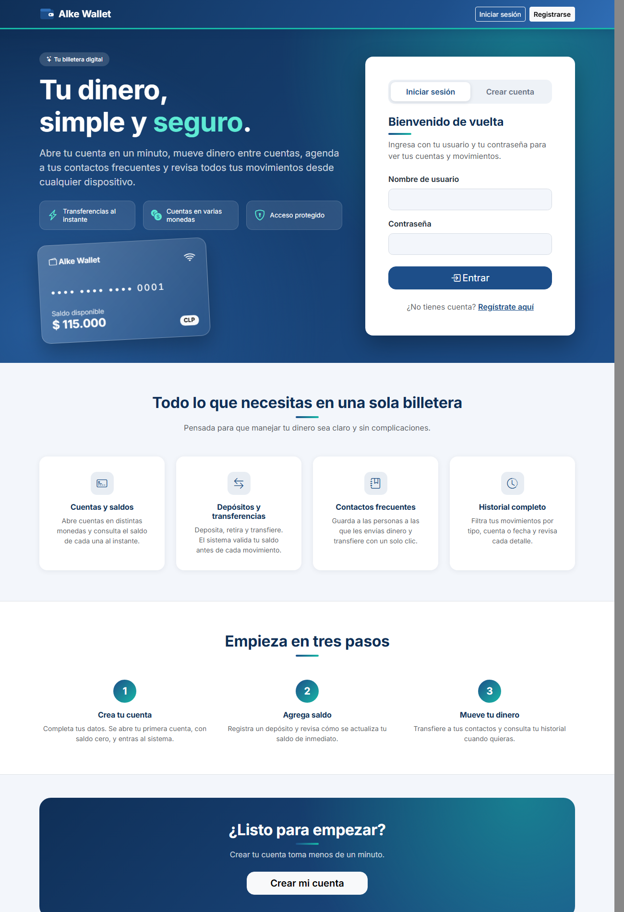
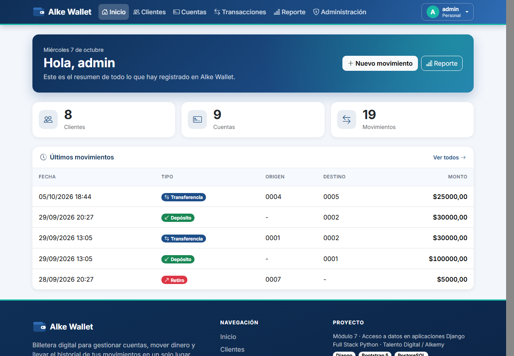
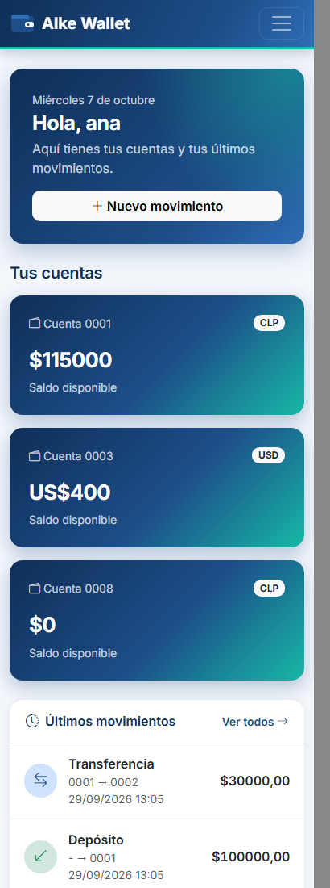
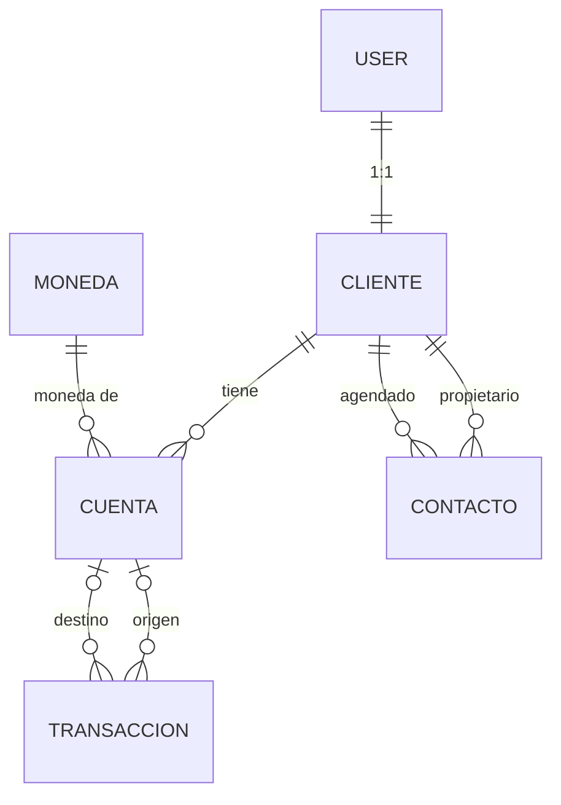

# Alke Wallet

Billetera digital desarrollada con **Django** para el proyecto final del **Módulo 7: Acceso a datos en aplicaciones Django** (Full Stack Python Trainee, Talento Digital / Alkemy). Permite crear y gestionar cuentas, registrar depósitos, retiros y transferencias, guardar contactos frecuentes y consultar saldos y reportes, con roles de acceso, protección CSRF y una interfaz adaptable a escritorio, tablet y celular.



**[Demostración en línea](https://javiermll.github.io/alke-wallet-django/)** · **[Documentación técnica (PDF)](docs/Alke_Wallet_Documentacion_Tecnica.pdf)** · [Informe de pruebas](docs/informe_pruebas.docx) · [Autor](#autor)

## Demostración en línea

**<https://javiermll.github.io/alke-wallet-django/>**. La aplicación corre en Render (plan gratuito) con la base de datos en Neon (PostgreSQL), en <https://alke-wallet.onrender.com>.

- **Primera visita:** el servidor gratuito se duerme tras 15 minutos sin visitas, así que la primera carga puede tardar cerca de un minuto. El enlace de arriba abre una página de espera que lo explica y entra sola cuando el servidor despierta.
- **Cómo probarla:** lo más directo es crear una cuenta propia desde **Crear cuenta**: toma menos de un minuto y abre una primera cuenta con saldo cero. Desde ahí se puede depositar, transferir, agendar contactos y ver el historial.
- **Panel de administración** (`/admin/`): privado; el autor comparte el acceso a quien lo solicite.

| Inicio del personal | Inicio de un cliente en celular |
|---|---|
|  |  |

## Funciones

- **Clientes y cuentas:** alta, ficha, edición y eliminación con vistas basadas en clases. El saldo de cada cuenta se calcula desde sus movimientos.
- **Movimientos:** depósitos, retiros y transferencias con validación de saldo, registro atómico y listado con filtros y paginación.
- **Contactos:** agenda por cliente, con atajo para transferir.
- **Reporte general:** movimientos por tipo, saldos por cliente y movimientos por mes, separados por moneda.
- **Roles y seguridad:** todo es privado salvo el login y el registro. El personal administra todo; cada cliente ve y toca solo lo suyo. Todos los formularios exigen token CSRF.
- **Registro y perfil:** una persona crea su usuario, su ficha y su primera cuenta, y puede cambiar su contraseña.
- **Panel de administración** de Django con columnas, búsqueda, filtros y tablas anidadas.
- **Interfaz moderna y adaptable** con Bootstrap 5, portada con inicio de sesión y registro, páginas de error 403, 404 y 500, y una ventana de espera cuando el servidor estaba dormido.
- **245 pruebas automatizadas.**

## Tecnologías

| Herramienta | Versión | Uso |
|---|---|---|
| Python | 3.14.6 (3.13.5 en Render) | Lenguaje base |
| Django | 6.1.1 | Framework web |
| PostgreSQL | 17 | Base de datos de producción (Neon) |
| SQLite | incluido en Python | Base de datos de desarrollo y de pruebas |
| psycopg (`psycopg[binary]`) | 3.3.6 | Adaptador de PostgreSQL |
| Bootstrap · Bootstrap Icons | 5.3.3 · 1.11.3 | Interfaz, por CDN |
| gunicorn · WhiteNoise | 26.2.0 · 6.12.0 | Servidor de aplicación y archivos estáticos en producción |
| dj-database-url · python-dotenv | 3.1.2 · 1.2.3 | Configuración por variables de entorno |
| Render · Neon · GitHub Pages | plan gratuito | Alojamiento, base de datos y página de espera |

## Decisiones técnicas destacadas

- **Consultas a distintos niveles:** ORM con `filter`, `exclude`, `annotate` y subconsultas; SQL propio con `raw()` y cursores, siempre con parámetros. Un comando (`demo_consultas`) compara el saldo del ORM con el del SQL puro.
- **Registro atómico de movimientos:** `registrar_transaccion()` valida y guarda dentro de una transacción, con bloqueo de la cuenta origen (`select_for_update`) para evitar saldos negativos.
- **Seguridad por capas:** `LoginRequiredMiddleware` (todo es privado por defecto), mixins de roles, filtros por dueño (un registro ajeno devuelve 404, no 403, para no revelar que existe) y CSRF en todos los formularios.
- **Las reglas viven en la base de datos y en el código:** restricciones de la base (`monto_positivo`, `contacto_unico` y `no_agendarse_a_si_mismo`) y validaciones en `clean()` (por ejemplo, qué cuentas exige cada tipo de movimiento), que se aplican en formularios y en el panel de administración.
- **Configuración sin secretos en el repositorio:** `DEBUG`, `SECRET_KEY`, hosts y `DATABASE_URL` se leen del entorno; con `DEBUG=False` la aplicación se niega a arrancar con la clave de desarrollo.
- **Despliegue reproducible:** `build.sh` y `render.yaml` instalan, reúnen estáticos, migran, crean el administrador desde variables de entorno y cargan los datos de demostración sin duplicar.

## Modelo de datos



| Modelo | Tabla | Descripción | Relaciones |
|---|---|---|---|
| `Moneda` | `gestion_moneda` | Monedas disponibles (código, nombre, símbolo) | 1 moneda → N cuentas |
| `Cliente` | `gestion_cliente` | Datos de negocio de cada persona | **1:1** con `User` de Django |
| `Contacto` | `gestion_contacto` | Ficha de agenda: quién guarda a quién, con apodo y fecha | Tabla intermedia del **N:M** Cliente ↔ Cliente |
| `Cuenta` | `gestion_cuenta` | Cuenta digital de un cliente en una moneda | **N:1** con Cliente y **N:1** con Moneda |
| `Transaccion` | `gestion_transaccion` | Depósito, retiro o transferencia | **N:1** con Cuenta origen y **N:1** con Cuenta destino |

**Reglas de negocio implementadas:**

| Tipo | Cuenta origen | Cuenta destino |
|---|---|---|
| Depósito | vacía | obligatoria |
| Retiro | obligatoria | vacía |
| Transferencia | obligatoria | obligatoria, distinta de la origen y de la misma moneda |

Otras reglas: el monto debe ser mayor que cero, un cliente no puede agendarse a sí mismo y no se puede agendar dos veces a la misma persona.

## Requisitos de la consigna

| Requisito | Dónde se cumple |
|---|---|
| Base de datos relacional: SQLite en desarrollo y PostgreSQL en producción | `core/settings.py`, etapas 1 y 3 del documento técnico |
| Modelos con relaciones 1:1, N:1 y N:M | `gestion/models.py`, [modelo de datos](#modelo-de-datos) |
| Migraciones | `gestion/migrations/`, etapa 3 |
| Consultas personalizadas (`filter`, `annotate`, `raw()`, cursores) | `gestion/consultas.py`, etapa 4 |
| CRUD con vistas basadas en clases y protección CSRF | `gestion/views.py` y `templates/`, etapas 6 y 7 |
| Aplicaciones preinstaladas: admin, auth y staticfiles | `gestion/admin.py`, etapas 5 y 7 |
| Ramas de Git por funcionalidad | [Flujo de Git](#flujo-de-git) |
| Pruebas e informe de pruebas | [Pruebas](#pruebas) |
| Documentación técnica | [PDF con el detalle de cada etapa](docs/Alke_Wallet_Documentacion_Tecnica.pdf) |

## Instalación y ejecución local

Los comandos están escritos para **PowerShell en Windows**.

```powershell
# 1. Clonar y entrar al proyecto
git clone https://github.com/Javiermll/alke-wallet-django.git
cd alke-wallet-django

# 2. Crear y activar el entorno virtual (el prompt debe empezar con (venv))
python -m venv venv
.\venv\Scripts\activate

# 3. Instalar las dependencias
python -m pip install -r requirements.txt

# 4. Crear el archivo de variables de entorno (por defecto usa SQLite)
Copy-Item .env.example .env

# 5. Crear las tablas y cargar datos de demostración (se puede repetir sin duplicar)
python manage.py migrate
python manage.py poblar_datos

# 6. Crear un superusuario para el panel de administración
python manage.py createsuperuser

# 7. Levantar el servidor en http://127.0.0.1:8000/
python manage.py runserver
```

`poblar_datos` crea los usuarios de demostración `ana`, `luis`, `carla`, `diego` y `marta`, y muestra una clave aleatoria una sola vez en pantalla. Para fijar una propia, se define `CLAVE_DEMO` en `.env` (ese archivo no se sube al repositorio). El código no contiene ninguna clave escrita.

Para usar PostgreSQL en local, se crea una base vacía (`CREATE DATABASE alke_wallet;`) y en `.env` se cambia a `DB_ENGINE=postgres`.

Roles para probar: el **personal** es el superusuario del paso 6 y ve todo; un **cliente** (`ana`, `luis`...) ve solo sus cuentas, movimientos y agenda. Con `DEBUG=True` las páginas de error se previsualizan en `/vista-403/`, `/vista-404/` y `/vista-500/`.

## Pruebas

El proyecto tiene **245 pruebas automatizadas** en `gestion/tests/` (modelos, servicios, consultas, formularios, vistas, seguridad, salud del servicio y comandos). Se ejecutan con SQLite y una base temporal, sin tocar los datos reales:

```powershell
# Todas las pruebas
python manage.py test gestion

# Comprobación manual de roles, alcance por usuario y CSRF (no deja datos)
python manage.py verificar_accesos
```

Resultado esperado: `Ran 245 tests` y `OK`. El [informe de pruebas](docs/informe_pruebas.docx) documenta los casos, los resultados y la verificación de que las pruebas detectan fallos; corresponde a las primeras 239 pruebas, y su actualización a 245 está pendiente.

## Despliegue

La aplicación se publica en **Render** con la base de datos en **Neon**, desde la rama `main`. Render lee `render.yaml`, ejecuta `build.sh` (instalar, `collectstatic`, `migrate`, `crear_superusuario` y `poblar_datos`) y arranca con gunicorn. Los valores privados se cargan en el panel de Render y no existen en el repositorio:

| Variable | Para qué sirve |
|---|---|
| `DATABASE_URL` | Conexión a la base de datos de Neon |
| `SECRET_KEY` | Clave secreta de Django (la genera Render) |
| `DEBUG`, `ALLOWED_HOSTS`, `CSRF_TRUSTED_ORIGINS` | Modo de ejecución y direcciones permitidas |
| `DJANGO_SUPERUSER_USERNAME`, `_EMAIL`, `_PASSWORD` | Administrador que crea `crear_superusuario` |
| `CLAVE_DEMO` | Clave de los usuarios de demostración |

La página de espera `docs/index.html`, publicada con GitHub Pages, consulta `/salud/` hasta que la aplicación despierta y entonces redirige a ella. El detalle de la configuración, las decisiones y las incidencias está en la etapa 10 del [documento técnico](docs/Alke_Wallet_Documentacion_Tecnica.pdf).

## Documentación técnica

[**Alke_Wallet_Documentacion_Tecnica.pdf**](docs/Alke_Wallet_Documentacion_Tecnica.pdf) reúne el detalle de cada etapa del proyecto: cómo se hizo, los comandos, las decisiones con sus alternativas descartadas, las incidencias y su solución, y las capturas de pantalla.

| Etapa | Contenido |
|---|---|
| 0 a 3 | Entorno, conexión a SQLite y PostgreSQL, modelos y migraciones |
| 4 | Consultas personalizadas: ORM, `raw()` y cursores |
| 5 | Panel de administración |
| 6 y 7 | Vistas basadas en clases, autenticación, roles, alcance por usuario y archivos estáticos |
| 8 | Pruebas automatizadas |
| 9 | Mejora visual con Bootstrap y diseño adaptable |
| 10 | Preparación y despliegue en Render y Neon |
| 11 | Revisión final y publicación |

## Estructura

```text
alke_wallet/
├── core/                  # Configuración: settings, rutas y formato de números chileno
├── gestion/               # App principal
│   ├── models.py          # Moneda, Cliente, Contacto, Cuenta, Transaccion
│   ├── consultas.py       # Consultas reutilizables: ORM, raw() y cursor
│   ├── servicios.py       # Registro atómico de movimientos y alta de cliente
│   ├── views.py, forms.py, urls.py, admin.py
│   ├── mixins.py, alcance.py   # Roles y filtros por dueño
│   ├── templatetags/      # Filtros para los formularios con Bootstrap
│   ├── management/commands/    # poblar_datos, demo_consultas, verificar_accesos, crear_superusuario
│   └── tests/             # 245 pruebas, un archivo por bloque
├── templates/             # Plantillas: base, páginas, componentes reutilizables y errores
├── static/                # CSS de marca sobre Bootstrap, JavaScript y logo
├── docs/                  # Documentación técnica (PDF), informe de pruebas, página de espera y vistas previas
├── build.sh, render.yaml  # Despliegue en Render
└── requirements.txt, .env.example, manage.py
```

## Flujo de Git

| Rama | Propósito | Estado |
|---|---|---|
| `main` | Código estable | Activa |
| `feature/modelos` | Definición de modelos y migraciones | Fusionada con `main` (fast-forward) |
| `feature/consultas` | Datos de demostración y consultas personalizadas | Fusionada con `main` |
| `feature/admin` | Idioma, nombres legibles y panel de administración | Fusionada con `main` |
| `feature/crud` | Vistas, formularios, servicio de movimientos, contactos y reporte | Fusionada con `main` |
| `feature/auth` | Login, estáticos, roles, alcance por usuario, registro, perfil y verificación de accesos | Fusionada con `main` |
| `feature/tests` | Pruebas automatizadas (modelos, servicios, consultas, formularios, vistas y seguridad) e informe | Fusionada con `main` |
| `fix/clave-demo` | Clave de los usuarios de demostración al azar o desde `.env` | Fusionada con `main` |
| `feature/bootstrap` | Rediseño con Bootstrap: portada, componentes, diseño responsive, páginas de error y formato de montos | Fusionada con `main` (7 commits por tema, fast-forward) |
| `feature/espera` | Endpoint `/salud/` y ventana de espera al iniciar sesión o registrarse | Fusionada con `main` |
| `feature/render` | Configuración de producción, `crear_superusuario`, `build.sh`, `render.yaml` y actualización del README | Fusionada con `main` |
| `feature/puente` | Página de espera en GitHub Pages y permiso CORS en `/salud/` | Fusionada con `main` |
| `feature/readme-resumido` | README resumido, enlace al documento técnico en PDF y retiro de las capturas sueltas | Fusionada con `main` |

## Mejoras futuras

- Recuperación de contraseña por correo y verificación del correo al registrarse.
- Bloqueo temporal tras varios intentos fallidos de ingreso.
- Número de cuenta generado de forma segura ante registros simultáneos.
- Medición de cobertura de código con `coverage.py` y pruebas de interfaz con un navegador automatizado.
- Modo oscuro (Bootstrap lo admite, pero la paleta de la marca está fija y habría que rediseñarla).
- Gráficos interactivos en el reporte (hoy las proporciones son barras hechas con CSS).
- Limpieza automática de los usuarios de prueba que se registren en la demostración pública.
- Dominio propio y envío real de correos (hoy el proyecto no envía ninguno).

## Autor

**Javier** · Full Stack Python Trainee (Talento Digital / Alkemy)

- GitHub: [github.com/Javiermll](https://github.com/Javiermll)
- LinkedIn: [linkedin.com/in/jamunozll](https://linkedin.com/in/jamunozll)
- Portafolio: [javiermll.github.io/Portafolio](https://javiermll.github.io/Portafolio)

Proyecto con fines educativos, desarrollado para el Módulo 7 del bootcamp.
