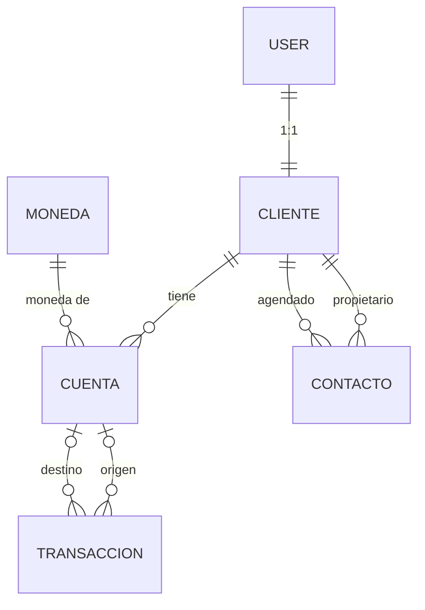

# Alke Wallet

Billetera digital desarrollada con Django para el proyecto final del **Módulo 7: Acceso a datos en aplicaciones Django** (Full Stack Python Trainee, Talento Digital / Alkemy).

La aplicación permitirá a los usuarios crear y gestionar cuentas digitales, realizar transacciones, guardar contactos frecuentes, consultar saldos y generar reportes, usando el ORM de Django, migraciones y las aplicaciones preinstaladas del framework.

## Estado del proyecto

| Etapa | Descripción | Estado |
|---|---|---|
| 0 | Entorno virtual, instalación de Django y repositorio Git | Completada |
| 1 | Conexión a base de datos (SQLite y PostgreSQL) | Completada |
| 2 | App `gestion` y modelos | Completada |
| 3 | Migraciones en SQLite y PostgreSQL | Completada |
| 4 | Consultas personalizadas (`filter`, `exclude`, `annotate`, `raw()`, cursores) | Pendiente |
| 5 | Panel de administración | Pendiente |
| 6 | Vistas CRUD basadas en clases y templates | Pendiente |
| 7 | Autenticación y archivos estáticos | Pendiente |
| 8 | Pruebas | Pendiente |
| 9 | Documentación final y demostración | Pendiente |

## Tecnologías

| Herramienta | Versión | Uso |
|---|---|---|
| Python | 3.14.6 | Lenguaje base |
| Django | 6.1.1 | Framework web |
| psycopg2-binary | 2.9.13 | Adaptador entre Django y PostgreSQL |
| python-dotenv | 1.2.3 | Lectura de credenciales desde el archivo `.env` |
| PostgreSQL | 17 | Base de datos de producción |
| SQLite | incluido en Python | Base de datos de desarrollo |
| Visual Studio Code | última versión | Editor |
| Git y GitHub | - | Control de versiones |

## Instalación y ejecución local

Los comandos están escritos para **PowerShell en Windows**.

### 1. Clonar el repositorio

```powershell
# Descarga el proyecto y entra a su carpeta
git clone <URL_DEL_REPOSITORIO>
cd alke_wallet
```

### 2. Crear y activar el entorno virtual

```powershell
# Crea el entorno virtual en la carpeta "venv"
python -m venv venv

# Lo activa; el prompt debe empezar con (venv)
.\venv\Scripts\activate
```

> Cada terminal nueva necesita la activación antes de trabajar. Sin `(venv)` en el prompt, Python usa la instalación global y Django no se encuentra.

### 3. Instalar las dependencias

```powershell
# Instala las librerías listadas en requirements.txt
python -m pip install -r requirements.txt
```

### 4. Configurar las variables de entorno

Copiar la plantilla `.env.example` como `.env` y completar los valores:

```powershell
# Crea el archivo .env a partir de la plantilla
Copy-Item .env.example .env
```

Contenido del `.env`:

```ini
# Motor a usar: "sqlite" (desarrollo) o "postgres" (producción)
DB_ENGINE=sqlite

# Datos de conexión a PostgreSQL (solo se usan si DB_ENGINE=postgres)
DB_NAME=alke_wallet
DB_USER=postgres
DB_PASSWORD=escribe_aqui_tu_contraseña
DB_HOST=localhost
DB_PORT=5432
```

Para usar PostgreSQL, crear antes la base de datos vacía (`CREATE DATABASE alke_wallet;`) y cambiar `DB_ENGINE=postgres`.

### 5. Aplicar las migraciones

```powershell
# Crea todas las tablas en la base configurada (las internas de Django y las de gestion)
python manage.py migrate
```

### 6. Ejecutar el servidor

```powershell
# Levanta el servidor de desarrollo en http://127.0.0.1:8000/
python manage.py runserver
```

## Arquitectura

```text
alke_wallet/
├── core/                      # Paquete de configuración del proyecto
│   ├── settings.py            # Configuración general y de base de datos
│   ├── urls.py                # Rutas principales
│   ├── asgi.py
│   └── wsgi.py
├── gestion/                   # App principal con la lógica del negocio
│   ├── migrations/
│   │   └── 0001_initial.py    # Migración inicial: crea las 5 tablas de la app
│   ├── models.py              # Modelos: Moneda, Cliente, Contacto, Cuenta, Transaccion
│   ├── admin.py               # Panel de administración (etapa 5)
│   ├── views.py               # Vistas (etapa 6)
│   └── tests.py               # Pruebas (etapa 8)
├── docs/
│   └── capturas/              # Capturas de pantalla usadas en este README
├── manage.py                  # Utilidad de línea de comandos de Django
├── requirements.txt           # Dependencias del proyecto
├── .env                       # Credenciales locales (NO se sube a GitHub)
├── .env.example               # Plantilla pública del .env
└── .gitignore                 # Archivos excluidos del repositorio
```

## Modelo de datos



| Modelo | Tabla | Descripción | Relaciones |
|---|---|---|---|
| `Moneda` | `gestion_moneda` | Monedas disponibles (código, nombre, símbolo) | 1 moneda → N cuentas |
| `Cliente` | `gestion_cliente` | Datos de negocio de cada persona | **1:1** con `User` de Django |
| `Contacto` | `gestion_contacto` | Ficha de agenda: quién guarda a quién, con apodo y fecha | Tabla intermedia del **N:M** Cliente ↔ Cliente |
| `Cuenta` | `gestion_cuenta` | Cuenta digital de un cliente en una moneda | **N:1** con Cliente y **N:1** con Moneda |
| `Transaccion` | `gestion_transaccion` | Depósito, retiro o transferencia | **N:1** con Cuenta origen y **N:1** con Cuenta destino |

**Reglas de negocio implementadas:**

| Tipo | Cuenta origen | Cuenta destino |
|---|---|---|
| Depósito | vacía | obligatoria |
| Retiro | obligatoria | vacía |
| Transferencia | obligatoria | obligatoria, distinta de la origen y de la misma moneda |

Otras reglas: el monto debe ser mayor que cero, un cliente no puede agendarse a sí mismo y no se puede agendar dos veces a la misma persona.

## Documentación por etapa

### Etapa 0: entorno y proyecto base

**Objetivo:** dejar un entorno aislado y reproducible con el proyecto Django funcionando y bajo control de versiones.

**Pasos realizados:**

```powershell
# 1. Crear la carpeta raíz y abrirla en VS Code
mkdir alke_wallet
cd alke_wallet
code .

# 2. Crear y activar el entorno virtual
python -m venv venv
.\venv\Scripts\activate

# 3. Instalar las librerías
python -m pip install django psycopg2-binary python-dotenv

# 4. Crear el proyecto con el paquete interno "core" (el punto evita una carpeta anidada)
python -m django startproject core .

# 5. Guardar la lista de librerías (utf8 evita que PowerShell genere UTF-16)
python -m pip freeze | Out-File -Encoding utf8 requirements.txt

# 6. Probar el servidor
python manage.py runserver

# 7. Iniciar el repositorio y guardar el primer commit
git init
git branch -M main
git add .
git commit -m "Configuración inicial del proyecto Django"
```

**Decisiones:**

- **Nombre `core`:** el paquete interno se llama `core` para evitar la estructura `alke_wallet/alke_wallet/`, que resulta confusa.
- **`.gitignore`:** excluye `venv/`, `__pycache__/`, `db.sqlite3`, `.env` y `.vscode/`. El entorno virtual y las credenciales nunca se versionan.
- **`requirements.txt`:** permite reconstruir el entorno en otro equipo con un solo comando.

**Incidencia resuelta:** en este equipo, una política de control de aplicaciones de Windows bloquea `pip.exe` dentro del entorno virtual.

```text
Error al ejecutar el programa 'pip.exe': Una directiva de Control de aplicaciones bloqueó este archivo
```

Solución: ejecutar pip a través del intérprete de Python, que sí está permitido.

```powershell
# En vez de: pip install ...
python -m pip install django psycopg2-binary python-dotenv

# En vez de: django-admin startproject ...
python -m django startproject core .
```

**Verificación:** al abrir `http://127.0.0.1:8000/` aparece la página de bienvenida de Django (el cohete).


### Etapa 1: conexión a la base de datos

**Objetivo:** configurar Django para conectarse a **SQLite** (desarrollo) y **PostgreSQL** (producción), alternando entre ambas sin modificar el código.

**Alternativas evaluadas:**

| Opción | Descripción | Resultado |
|---|---|---|
| A. Variable `DB_ENGINE` en `.env` | Un solo `settings.py`; se cambia una línea del `.env` | **Elegida:** cumple la consigna y demuestra ambas conexiones |
| B. Dos archivos de settings | `settings_dev.py` y `settings_prod.py` | Descartada: agrega complejidad innecesaria para este alcance |
| C. Solo SQLite con PostgreSQL comentado | Mínimo exigido | Descartada: la conexión a PostgreSQL quedaría sin demostrar |

**Creación de la base de datos en PostgreSQL:**

```powershell
# Entra a PostgreSQL con el usuario postgres
psql -U postgres
```

```sql
-- Crea la base de datos vacía del proyecto
CREATE DATABASE alke_wallet;

-- Sale de psql
\q
```

**Configuración en `core/settings.py`:**

```python
# "os" permite leer variables de entorno del sistema
import os

# load_dotenv lee el archivo .env y carga sus valores como variables de entorno
from dotenv import load_dotenv

# Carga las variables del archivo .env que está en la raíz del proyecto
load_dotenv(BASE_DIR / '.env')

# Lee del .env qué motor usar; si la variable no existe, usa "sqlite" por defecto
DB_ENGINE = os.getenv('DB_ENGINE', 'sqlite')

# Si en el .env se indicó "postgres", se configura la conexión a PostgreSQL
if DB_ENGINE == 'postgres':
    DATABASES = {
        'default': {
            # Adaptador de PostgreSQL (psycopg2)
            'ENGINE': 'django.db.backends.postgresql',
            # Nombre de la base de datos, usuario y contraseña
            'NAME': os.getenv('DB_NAME'),
            'USER': os.getenv('DB_USER'),
            'PASSWORD': os.getenv('DB_PASSWORD'),
            # Dónde corre PostgreSQL y en qué puerto
            'HOST': os.getenv('DB_HOST', 'localhost'),
            'PORT': os.getenv('DB_PORT', '5432'),
        }
    }
# En cualquier otro caso se usa SQLite (archivo db.sqlite3 en la raíz)
else:
    DATABASES = {
        'default': {
            'ENGINE': 'django.db.backends.sqlite3',
            'NAME': BASE_DIR / 'db.sqlite3',
        }
    }
```

**Seguridad:** las credenciales viven únicamente en el `.env`, que está en el `.gitignore`. El repositorio incluye `.env.example`, una plantilla sin la contraseña real.

**Verificación de la conexión con cada motor:**

```powershell
# Lista las migraciones; si la conexión funciona, Django las muestra todas sin aplicar ([ ])
python manage.py showmigrations

# Confirma qué motor y qué base está usando Django en este momento
python manage.py shell -c "from django.db import connection; print(connection.vendor, connection.settings_dict['NAME'])"
```

Resultados obtenidos:

| `DB_ENGINE` | Salida del comando de verificación |
|---|---|
| `sqlite` | `sqlite <ruta>\db.sqlite3` |
| `postgres` | `postgresql alke_wallet` |

En ambos casos `showmigrations` lista las 18 migraciones internas de Django (`admin`, `auth`, `contenttypes` y `sessions`) sin aplicar. Es lo esperado: se aplican en la etapa 3.


**Solución de errores frecuentes:**

| Error | Causa probable |
|---|---|
| `No module named 'django'` | El entorno virtual no está activo |
| `password authentication failed` | La contraseña del `.env` no coincide con la de PostgreSQL |
| `database "alke_wallet" does not exist` | Falta crear la base de datos |
| `connection refused` | El servicio de PostgreSQL no está corriendo |

### Etapa 2: app `gestion` y modelos

**Objetivo:** crear la app principal y definir el modelo de datos con el ORM de Django, con campos adecuados, validaciones y relaciones Uno a Uno, Muchos a Uno y Muchos a Muchos.

**Pasos realizados:**

```powershell
# Crea la rama de trabajo que pide la consigna y se cambia a ella
git checkout -b feature/modelos

# Crea la app "gestion"
python manage.py startapp gestion
```

Registro de la app en `core/settings.py`:

```python
INSTALLED_APPS = [
    'django.contrib.admin',
    'django.contrib.auth',
    'django.contrib.contenttypes',
    'django.contrib.sessions',
    'django.contrib.messages',
    'django.contrib.staticfiles',
    # Nuestra app; sin esta línea Django no reconoce sus modelos
    'gestion',
]
```

**Decisiones de diseño:**

| Tema | Elegida | Alternativa descartada | Motivo |
|---|---|---|---|
| Relación N:M | Contactos frecuentes entre clientes (Cliente ↔ Cliente) | Categorías de transacción | Se acerca más al funcionamiento de una billetera real |
| Contactos | Modelo intermedio `Contacto` con apodo y fecha | `ManyToManyField` simple | Permite guardar datos propios de la relación |
| Saldo | Calculado sumando transacciones | Columna `saldo` guardada y actualizada | Nunca queda desincronizado con los movimientos |
| Monedas | Transferencias solo entre cuentas de la misma moneda | Conversión con tasas de cambio | La conversión queda fuera del alcance |

**Fragmentos clave de `gestion/models.py`** (el archivo completo está en el repositorio):

Relación N:M de Cliente consigo mismo, a través de la tabla intermedia `Contacto`:

```python
# 'self' significa "el mismo modelo"
# through='Contacto': la tabla intermedia la definimos nosotros
# through_fields indica cuál campo de Contacto es "quien agenda" y cuál "a quién agenda"
# symmetrical=False: si Ana agenda a Luis, Luis NO queda agendado por Ana automáticamente
contactos = models.ManyToManyField(
    'self',
    through='Contacto',
    through_fields=('propietario', 'agendado'),
    symmetrical=False,
    related_name='agendado_por',
)
```

Restricciones que la propia base de datos hace cumplir en `Contacto`:

```python
constraints = [
    # No se puede agendar dos veces a la misma persona
    models.UniqueConstraint(fields=['propietario', 'agendado'], name='contacto_unico'),
    # Nadie puede agendarse a sí mismo
    models.CheckConstraint(
        condition=~models.Q(propietario=models.F('agendado')),
        name='no_agendarse_a_si_mismo',
    ),
]
```

Saldo calculado en `Cuenta`, sin columna en la tabla:

```python
# @property permite usarlo como un dato más: cuenta.saldo (sin paréntesis)
@property
def saldo(self):
    # Suma todo el dinero que ha llegado a esta cuenta (None si no hay movimientos)
    entradas = self.transacciones_recibidas.aggregate(total=Sum('monto'))['total'] or Decimal('0.00')
    # Suma todo el dinero que ha salido de esta cuenta
    salidas = self.transacciones_enviadas.aggregate(total=Sum('monto'))['total'] or Decimal('0.00')
    # El saldo es lo que entró menos lo que salió
    return entradas - salidas
```

**Doble protección de datos:**

| Nivel | Herramienta | Dónde actúa |
|---|---|---|
| Python | `MinValueValidator` y `clean()` | Formularios y panel de administración, con mensajes claros |
| Base de datos | `UniqueConstraint` y `CheckConstraint` | Toda escritura, incluso desde la shell |

**Notas técnicas:**

- `on_delete=PROTECT` en `Cuenta.moneda` y en las cuentas de `Transaccion` impide borrar monedas o cuentas que tengan datos asociados. `CASCADE` se usa donde los datos dependientes no tienen sentido sin su padre (cuentas de un cliente, fichas de contacto).
- Django 6 usa `condition=` en `CheckConstraint`. Los ejemplos antiguos usan `check=`, que ya no existe.
- La regla "no retirar más de lo que hay" no vive en `clean()`. Se aplicará en las vistas, dentro de una operación atómica, para no rechazar la edición de movimientos ya registrados.

**Verificación:**

```powershell
# Revisa que los modelos no tengan errores (no toca la base de datos)
python manage.py check
```

Resultado: `System check identified no issues (0 silenced).`


### Etapa 3: migraciones

**Objetivo:** aplicar las migraciones para reflejar los modelos en el esquema de la base de datos de forma controlada y con historial versionado, en SQLite y en PostgreSQL.

**Idea central:** `makemigrations` escribe el plan (un archivo Python que describe qué crear) y `migrate` lo ejecuta sobre la base de datos. Cada cambio futuro en los modelos generará una migración nueva en vez de modificar la anterior.

**Pasos realizados:**

```powershell
# 1. Genera el plan de migración a partir de los modelos
python manage.py makemigrations gestion

# 2. Muestra el SQL exacto que se ejecutará (no modifica la base)
python manage.py sqlmigrate gestion 0001

# 3. Aplica todas las migraciones pendientes
python manage.py migrate

# 4. Confirma que todas aparecen aplicadas [X]
python manage.py showmigrations

# 5. Lista las tablas creadas en la base que Django está usando
python manage.py shell -c "from django.db import connection; print(sorted(connection.introspection.table_names()))"
```

**Resultado de `makemigrations`:** se creó `gestion/migrations/0001_initial.py` con:

```text
+ Create model Moneda
+ Create model Cliente
+ Create model Contacto
+ Add field contactos to cliente
+ Create model Cuenta
+ Create model Transaccion
+ Create constraint contacto_unico on model contacto
+ Create constraint no_agendarse_a_si_mismo on model contacto
+ Create constraint monto_positivo on model transaccion
```

**Resultado de `migrate`:** se aplicaron 19 migraciones: las 18 internas de Django (`admin`, `auth`, `contenttypes`, `sessions`) más `gestion.0001_initial`.

**Tablas creadas (idénticas en ambos motores):**

| Origen | Tablas |
|---|---|
| App `gestion` | `gestion_moneda`, `gestion_cliente`, `gestion_contacto`, `gestion_cuenta`, `gestion_transaccion` |
| Autenticación (`auth`) | `auth_user`, `auth_group`, `auth_permission`, `auth_group_permissions`, `auth_user_groups`, `auth_user_user_permissions` |
| Administración y sesiones | `django_admin_log`, `django_content_type`, `django_session` |
| Control de migraciones | `django_migrations` |

En PostgreSQL, la verificación se repitió con `psql`:

```powershell
# Lista las tablas de la base alke_wallet en PostgreSQL
psql -U postgres -d alke_wallet -c "\dt"
```

Resultado: 15 tablas, todas en el esquema `public`.

**Prueba funcional en la shell** (`python manage.py shell`), repetida en ambos motores:

```python
# Importa el usuario de login y nuestros modelos
from django.contrib.auth.models import User
from gestion.models import Moneda, Cliente, Contacto, Cuenta, Transaccion

# Crea la moneda
clp = Moneda.objects.create(codigo='CLP', nombre='Peso chileno', simbolo='$')

# Crea dos usuarios de login; create_user guarda la contraseña cifrada
u1 = User.objects.create_user(username='ana', password='<contraseña_de_prueba>')
u2 = User.objects.create_user(username='luis', password='<contraseña_de_prueba>')

# Crea un cliente por cada usuario (relación 1:1)
ana = Cliente.objects.create(usuario=u1, nombre='Ana García', email='ana@example.com', telefono='123456789')
luis = Cliente.objects.create(usuario=u2, nombre='Luis Pérez', email='luis@example.com')

# Crea una cuenta para cada cliente, ambas en pesos
c_ana = Cuenta.objects.create(cliente=ana, moneda=clp, numero='0001')
c_luis = Cuenta.objects.create(cliente=luis, moneda=clp, numero='0002')

# Un depósito de 100000 en la cuenta de Ana (solo tiene destino)
Transaccion.objects.create(tipo='deposito', cuenta_destino=c_ana, monto=100000)

# Una transferencia de 30000 de Ana a Luis
Transaccion.objects.create(tipo='transferencia', cuenta_origen=c_ana, cuenta_destino=c_luis, monto=30000)

# Ana agenda a Luis como contacto (se crea la ficha intermedia)
Contacto.objects.create(propietario=ana, agendado=luis, apodo='Lucho')

# Saldos calculados, contactos de Ana y agendas donde aparece Luis
print(c_ana.saldo, c_luis.saldo)
print(ana.contactos.all())
print(luis.agendado_por.all())

# La base de datos debe rechazar un monto 0 (restricción monto_positivo)
from django.db import IntegrityError
try:
    Transaccion.objects.create(tipo='deposito', cuenta_destino=c_ana, monto=0)
except IntegrityError:
    print('La base rechazó el monto 0')
```

Resultados obtenidos:

| Comprobación | SQLite | PostgreSQL |
|---|---|---|
| Saldo de Ana (100000 − 30000) | `70000` | `70000.00` |
| Saldo de Luis | `30000.00` | `30000.00` |
| Contactos de Ana | `Luis Pérez` | `Luis Pérez` |
| Agendas donde aparece Luis | `Ana García` | `Ana García` |
| Monto 0 | Rechazado por la base | Rechazado por la base |

Estos datos de prueba se conservan en ambas bases para las consultas de la etapa 4.

**Reflexiones:**

- **Historial versionado:** la migración `0001_initial.py` se versiona en Git. Cualquier persona que clone el repositorio reconstruye el mismo esquema con `migrate`. El archivo `db.sqlite3` no se versiona porque contiene datos, no código.
- **Un plan, dos dialectos:** los mismos archivos de migración sirven para SQLite y PostgreSQL. El ORM traduce cada modelo al SQL de cada motor.
- **Reconstrucción de tablas en SQLite:** `sqlmigrate` muestra que SQLite no puede añadir restricciones a una tabla existente. Django crea una tabla temporal `new__...`, copia los datos, borra la original y renombra la nueva. Es una limitación del motor, que el ORM resuelve automáticamente.
- **Decimales:** SQLite no tiene un tipo decimal nativo, por eso el saldo de Ana se muestra como `70000` y no como `70000.00`. El valor es el mismo. PostgreSQL sí conserva los dos decimales.
- **Validaciones:** las creaciones desde la shell no ejecutan `clean()`; solo actúan las restricciones de la base de datos. Por eso el monto 0 se probó con `IntegrityError`. Las reglas de `clean()` se comprobarán en formularios y en el panel de administración.


## Flujo de Git

| Rama | Propósito | Estado |
|---|---|---|
| `main` | Código estable | Activa |
| `feature/modelos` | Definición de modelos y migraciones | Fusionada con `main` (fast-forward) |
| `feature/crud` | Vistas y formularios | Pendiente |

## Próximas etapas

Las secciones sobre consultas personalizadas, panel de administración, CRUD, autenticación, pruebas y demostración se agregarán a medida que se completen las etapas correspondientes.
